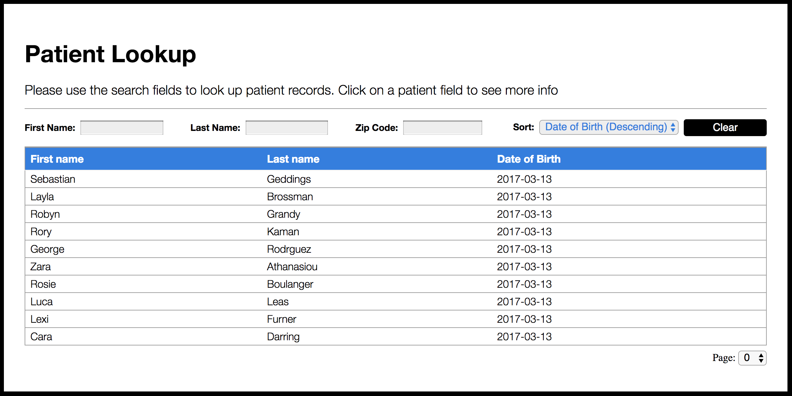
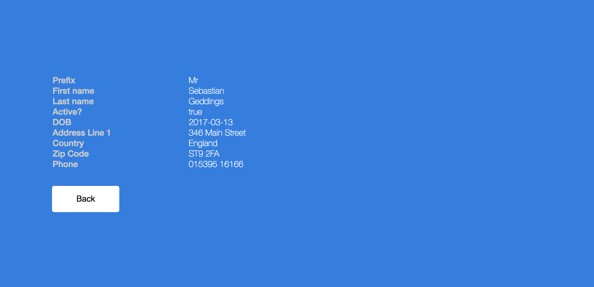

# Overview

A solution to a tech test for [HealthForge Limited](https://healthforge.io/about-us).
The main goal of the test was to build an application that interacts with their
HealthForge Patient API.

The test was split into two Questions;

## Question 1

Create an application that uses the API and displays a list of patients.
You can use any frameworks and technologies you like.

### Must Have
- [x] Display a list of patients with header columns  
- [x] Clicking on a patient in the list should display that patient's details

### Should Have
- [x] Allow searching
- [x] Implement paging
- [x] Implement sorting
- [x] Implement filtering
- [x] Look half-decent

### Could Have
- [ ] Good UX
- [ ] Good looking styling

## Question 2

Create a copy of your application in Question 1 and modify it to use a **secure** resource,
using OpenID Connect authentication


## My solution

### Screenshots

#### Main View


#### Selected Patient View


### Demo

To demo my solution, clone the repository then install dev dependencies with;
```
npm install
```
and
```
npm run start.dev
```
Visit `localhost:4444` in the browser, then enter the
HealthForge credentials when prompted. You will then be redirected back to begin
using the app.

### Summary

I built a node server and client side using a minimal set of technologies.

The runtime dependencies for the project are;
- Keycloak (required for OpenID Connect authentication)
- Tachyons (for css classnames).

Dev-dependencies include;
- Eslint (using prettier config)
- Nodemon
- webpack + babel plugins (for bundling client side app)
- concurrently (for running the server server & watching webpack).

Documentation style
- JSDoc

Client Side architecture pattern
- Model-View-Update (inspired by Elm)

### Completion Time

- Around 16 hours (Begin Time: 19/08/2017 11:30AM, End Time: 20/08/2017 16:00PM)

### Notes

This was lots of fun to complete! HealthForges API was pretty solid and simple to use, the solution I made only scratches the surfaces on whats available for patient data, so I'd be keen to see how far developers have gone with real world implementations with the API.

The test has given me some useful experience writing vanilla JS solutions and I now feel more confident working with the DOM. I've worked a lot with robust front-end frameworks recently so wanted a bit of challenge.

### Future Tasks (in spare time)

- Implement a 'lite' version of the app (no authentication needed, allowing users
  to explore the open data only)
- Add content in selected patient view
- Add unit/integration/e2e tests
- Enhance view implementation (build a virtual DOM for dynamic rendering)
- Enhance UX (particularly accessibility)
